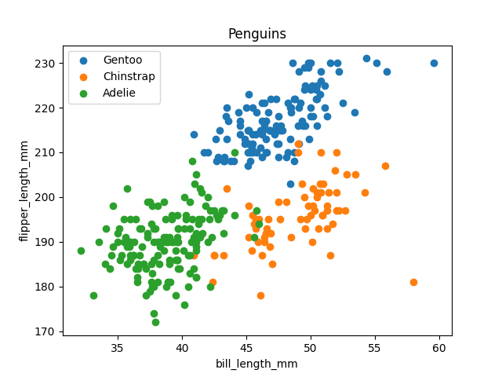

firstly we need to clone the repo
## Clone a repo

```
git clone <URL from the github.com GUI>
```
then we need to update the repo sow we git pull
## Update a repo

Remember, before making local changes:

```
git pull
```
## Instructions
go to the directory where you cloned the repo
type the command

```
make data
```
### Reproducible results

Recreate the chart below with the command below
```
make penguin
```
images




### Clean

Clean everything
```
make clean
