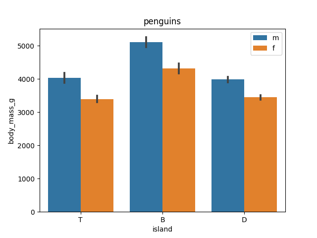

# hw-seaborn

This is the barplot example from the [seaborn.barplot](https://seaborn.pydata.org/generated/seaborn.barplot.html)
reference docs:
```
sns.barplot(data=df, x="island", y="body_mass_g", hue="sex")
```
The return value from the method is an instance of [matplotlib.axes](https://matplotlib.org/stable/api/axes_api.html).
Recall that seaborn is built "on top of" matplotlib.
You'll be using the matplotlib API to customize the tick labels and legend labels for this demo.
In each case, you should replace the labels with the first character of the text that you get from the axes object.
In other words, if the label is the string `label = "Torgersen"`, then replace the label with `label[0]`.

* Part 1: Use the return value to customize the tick labels on the x axis
  * Look here for hints: [pyplot.xticks API reference](https://matplotlib.org/stable/api/_as_gen/matplotlib.pyplot.xticks.html)
* Part 2: Use the return value to customize the labels in the legend.
  * Look here for hints: [matplotlib legend tutorial](https://matplotlib.org/stable/tutorials/intermediate/legend_guide.html)
* Part 3: Provide links to every (other) resource that you used to solve these problems, whether they're blog posts, stackoverflow posts, or anything else.

Use the same [git-intro](https://github.com/ds5110/git-intro) format this assignment that we used before.

## Q1: Presentation of results

This section recreates and presents the first chart in Figure 1.1 of ISLR2.
Recreate the chart below with
```
make q1
```



# Instructions:
* type:make data
* type:make penguin
* type:make clean (to clean)
# Citations:
* (https://matplotlib.org/stable/tutorials/intermediate/legend_guide.html)
* (https://www.statology.org/pandas-unique-values-in-column/)
* (https://www.geeksforgeeks.org/how-to-adjust-number-of-ticks-in-seaborn-plots/)
* (https://pandas.pydata.org/docs/reference/api/pandas.DataFrame.dropna.html)
* (https://matplotlib.org/3.4.2/api/container_api.html#:~:text=Bases%3A%20matplotlib.container.Container,further%20parameters%20by%20the%20attributes.)
* (https://stackoverflow.com/questions/24318161/legend-format-lost-after-using-ax-legendhandles-labels)
* (https://matplotlib.org/3.1.1/_modules/matplotlib/text.html#Text.set_fontstyle)


# Packages
* packages needed for this
* pandas
* matplotlib.plt
* seaborn
