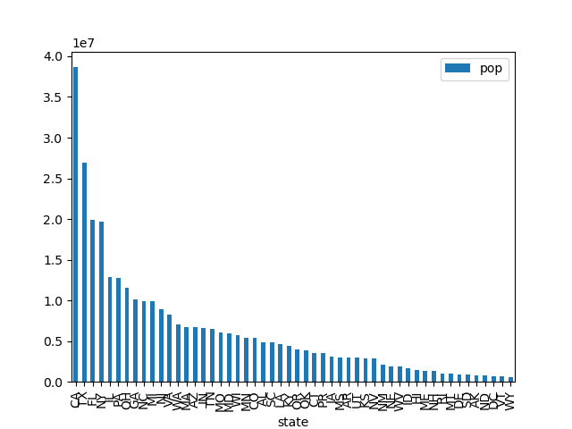
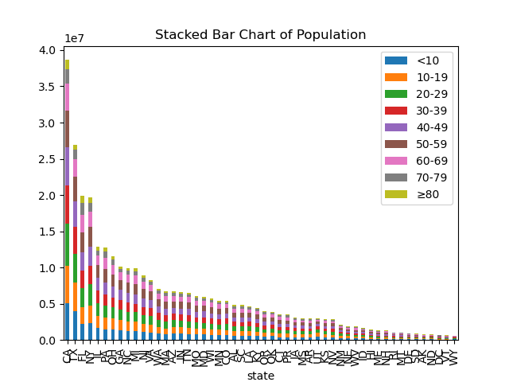
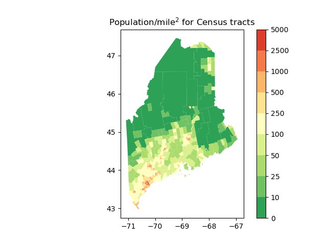

# hw-census

Working with census data

* [Working with the Census API](https://observablehq.com/@mbostock/working-with-the-census-api) -- Observable notebook
* [Stacked Bar Chart](https://observablehq.com/@d3/stacked-bar-chart) -- Observable notebook

## git-intro

Follow guidelines in the [git-intro](https://github.com/ds5110/git-intro/blob/main/README.md) repo.

## EXERCISE #1: Census.gov query

* Write Python code to reconstruct the query in [Stacked Bar Chart](https://observablehq.com/@d3/stacked-bar-chart) -- Observable notebook
* Use the following list
```
["B01001_003E","B01001_004E","B01001_027E","B01001_028E",
 "B01001_005E","B01001_006E","B01001_007E","B01001_029E","B01001_030E","B01001_031E",
 "B01001_008E","B01001_009E","B01001_010E","B01001_011E","B01001_032E","B01001_033E","B01001_034E","B01001_035E",
 "B01001_012E","B01001_013E","B01001_036E","B01001_037E",
 "B01001_014E","B01001_015E","B01001_038E","B01001_039E",
 "B01001_016E","B01001_017E","B01001_040E","B01001_041E",
 "B01001_018E","B01001_019E","B01001_020E","B01001_021E","B01001_042E","B01001_043E","B01001_044E","B01001_045E",
 "B01001_022E","B01001_023E","B01001_046E","B01001_047E",
 "B01001_024E","B01001_025E","B01001_048E","B01001_049E"]
```
* Verify that you correctly constructed the URL

## EXERCISE #2: Bar chart of state populations

* Using the data from the Exercise #1, create a bar chart (not stacked) of total population by state
* Add the postal codes using the following data
```
# Postal codes for states (easier for most humans to understand than FIPS)
[["01", "AL"], ["02", "AK"], ["04", "AZ"], ["05", "AR"], ["06", "CA"], ["08", "CO"], 
 ["09", "CT"], ["10", "DE"], ["11", "DC"], ["12", "FL"], ["13", "GA"], ["15", "HI"], 
 ["16", "ID"], ["17", "IL"], ["18", "IN"], ["19", "IA"], ["20", "KS"], ["21", "KY"], 
 ["22", "LA"], ["23", "ME"], ["24", "MD"], ["25", "MA"], ["26", "MI"], ["27", "MN"], 
 ["28", "MS"], ["29", "MO"], ["30", "MT"], ["31", "NE"], ["32", "NV"], ["33", "NH"], 
 ["34", "NJ"], ["35", "NM"], ["36", "NY"], ["37", "NC"], ["38", "ND"], ["39", "OH"], 
 ["40", "OK"], ["41", "OR"], ["42", "PA"], ["44", "RI"], ["45", "SC"], ["46", "SD"], 
 ["47", "TN"], ["48", "TX"], ["49", "UT"], ["50", "VT"], ["51", "VA"], ["53", "WA"], 
 ["54", "WV"], ["55", "WI"], ["56", "WY"], ["72", "PR"]]
```

## EXERCISE #3: Stacked bar chart of state populations

* Reproduce this [Stacked Bar Chart](https://observablehq.com/@d3/stacked-bar-chart)
* Use the following groupings
```
[["<10", ["003", "004", "027", "028"]], 
 ["10-19", ["005", "006", "007", "029", "030", "031"]], 
 ["20-29", ["008", "009", "010", "011", "032", "033", "034", "035"]], 
 ["30-39", ["012", "013", "036", "037"]], 
 ["40-49", ["014", "015", "038", "039"]], 
 ["50-59", ["016", "017", "040", "041"]], 
 ["60-69", ["018", "019", "020", "021", "042", "043", "044", "045"]], 
 ["70-79", ["022", "023", "046", "047"]], 
 ["≥80", ["024", "025", "048", "049"]]]
```

## EXERCISE #4: Map of population density

Merge the census geographies and population to create a map of population density that you can compare to the [Wikipedia version](https://en.wikipedia.org/wiki/Maine).

## My Work
The first exercise we wish to do is to produce a total population bar chart for each state.We can do this by typing the code below
```
make one
```
This proudces the graph below, which can be found in the img file

The second exercise we wish to do is to produce a total population bar chart for
each state and make this a stacked bar chart with each band representing a different age group.We can do this by typing the code below
```
make two
```
This proudces the graph below, which can be found in the img file


The three exercise we wish to do is to produce a map of population density in the state of maine. We can do this by typing the code below
```
make three
```
This proudces the graph below, which can be found in the img file

You can clean the data by typing the code below
```
make clean
```
The data url's are found in the file being found at census.gov, code help from Professor Bogden


